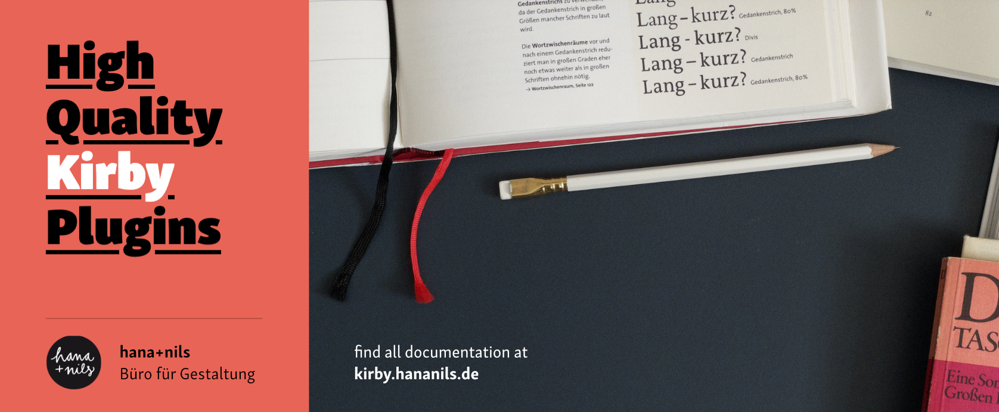

[](https://kirby.hananils.de/plugins/designer)

Designer is a layout tool for your templates. It takes markup from your fields, from static or external sources and let’s you manipulate it with a Kirby-like interface. Need to change headline hierarchy? Need to add a class or extract content? Designer has you covered.

## Introduction

It’s easy to run into situations, where the markup available does not suit the needs of your current template. You might have HTML from a field with all headlines starting at the highest level `h1`. This might be just fine for the single view of that page but on the overview, you’d like to display the same text in the sidebar which requires a starting level of `h3`. Designer let’s you adapt your markup to this situation:

```php
<div class="sidebar"> 
  <?= $page->text()->designer()->level(3) ?>
</div>
```

[Read more how to get started with Designer in our guides](https://kirby.hananils.test/plugins/designer/getting-started).

> [!TIP]
> Having a designer at hand is always handy. This is not only true when layouting fields, but can also be very helpful when dealing with content from external APIs or virtual pages.

### Selecting elements

Your options to tailor your markup do not stop at headlines, but allow you to select and manipulate the output at your liking. You can select elements, add classes, wrap text. Designer gives you access the the full DOM of your content:

```php
<?= $page->text()->designer()->select('p:first-of-type')->addClass('introduction'); ?>
```

[Read more on selections](https://kirby.hananils.test/plugins/designer/selecting-elements).

### Filtering elements

While selections help you altering your markup, this is not always enough. Filtering works the same as selecting, but only keeps the filtered elements, discarding the rest:

```php
<?php

// This will only keep your paragraphs
$paragraphs = $designer->filter('p');

// And there are more advanced filter to extract elements, too 
$startingInlines = $designer->filterBy('isBlockStart', '==', true);
```

[Read more on filtering](https://kirby.hananils.test/plugins/designer/filtering-elements).

### Conditional layouts: x-ray your field output

As web developer, you never know the final content you have to layout and thus have to prepare for this uncertainty. Designer can be your assistent here as it let’s you analyse your content on output:

```php
<?php if ($page->text()->has('blockquote')): ?>
    <?= snippet('text-with-pullquote') ?>
<?php else: ?>
    <?= snippet('text') ?>
<?php endif ?>
```

[Read more about how to work with the DOM](https://kirby.hananils.test/plugins/designer/working-with-the-dom).

### Enhanced snippets

Designer comes with two options to work with snippets. First, it offers a direct replacement for the core `snippet` helper which gives you direct access to the DOM resulting from your snippets. Second, it allows you to apply snippets to the markup of your field output.

Designer can be used with slots and gives you options to collapse and trim whitespace or adjust headlines globally:

```php
<?php design('layout', slots: true, level: 3, collapse: true, trim: true); ?>

<!-- Continue layouting here as usually -->
```

Without slots, it allows you to adjust your markup on the fly by replacing `snippet()` with `designer()`:

```php
<?php

// This is the same as snippet('content') but it allows chaining manipulations or traversal actions
design('content')->select('p:first-of-type')->addClass('introduction');
```

If you have field output that you’d like to enhance with more complex layouts, you can apply snippets to your field directly:

```php
<?php

// This is matching elements to snippets of the same name inside /site/snippets/elements
$page->text()->designer()->snippets('elements');
```

[Read more about Designer’s extended snippets options](https://kirby.hananils.test/plugins/designer/changing-html-with-snippets).

## Use-cases

With all this at hand, these are the most common use-cases for Designer:

- extracting content
- adding classes by rules
- building jump-marks
- inlining CSS for e-mail delivery
- re-using content in different hierarchical contexts
- normalizing whitespace (collapsing and trimming, either globally or custom tailored)

Get into using Designer by reading [more about the basic concepts](https://kirby.hananils.test/plugins/designer/getting-started) and [how to start using it](https://kirby.hananils.test/plugins/designer/initialising-designer).

> \[!important\] Please note that this plugin makes use of the latest `Dom` additions in PHP 8.4 and their extensions in PHP 8.5. Thus **PHP 8.5 is a requirement** for this plugin.

## Installation

By default, plugins in Kirby reside in a special folder located at `/site/plugins`. Each plugin is installed in its proprietary subfolder. This installation can be handled in four different ways: you can either install them manually or manage them using Kirby CLI, Git submodules or Composer. You can install Designer either way and should choose the method suiting your project best.

Please note that all examples given here assume you are using the default plugin root. [If you changed your plugin root](https://getkirby.com/docs/reference/system/roots/plugins), e. g. with a custom folder setup, you’ll also have to adjust the paths given in this guide. For further information on how to manage plugins, please read the [official Kirby plugin introduction](https://getkirby.com/docs/guide/plugins/plugin-basics).

### Download

Download and copy this repository to `/site/plugins/designer`.

### Kirby CLI

```shell
kirby plugin:install hananils/kirby-designer
```

### Git submodule

```bash
git submodule add \
    https://github.com/hananils/kirby-designer.git \
    site/plugins/designer
```

### Composer

```shell
composer require hananils/kirby-designer
```

## Documentation

[](https://kirby.hananils.de/plugins/designer)

Where possible, files contain inline annotations. For extended documentation, please visit our dedicated plugin site at [kirby.hananils.de/​plugins/​designer](https://kirby.hananils.de/plugins/designer).

### Guides

- [Basic concepts](https://kirby.hananils.de/plugins/designer/getting-started)
- [Using Designer](https://kirby.hananils.de/plugins/designer/initialising-designer)
- [Selecting elements](https://kirby.hananils.de/plugins/designer/selecting-elements)
- [Filtering elements](https://kirby.hananils.de/plugins/designer/filtering-elements)
- [Collections](https://kirby.hananils.de/plugins/designer/collections)
- [Working with the DOM](https://kirby.hananils.de/plugins/designer/working-with-the-dom)
- [Applying snippets](https://kirby.hananils.de/plugins/designer/changing-html-with-snippets)

### Cookbook

- [Setting anchor ids](https://kirby.hananils.de/plugins/designer/setting-anchor-ids)
- [Sanatizing snippets used within KirbyTags](https://kirby.hananils.de/plugins/designer/sanatizing-snippets-used-within-kirbytags)

### Reference

- [Field Methods](https://kirby.hananils.de/plugins/designer/field-methods)
- [Blocks Methods](https://kirby.hananils.de/plugins/designer/blocks-methods)
- [Block Methods](https://kirby.hananils.de/plugins/designer/block-methods)
- [Core Components](https://kirby.hananils.de/plugins/designer/core-components)
- [Helpers](https://kirby.hananils.de/plugins/designer/helpers)

## License

This plugin is provided freely under the [MIT license](https://kirby.hananils.de/plugins/designer/license) by [hana+nils · Büro für Gestaltung](https://kirby.hananils.de). We create visual designs for digital and analog media.